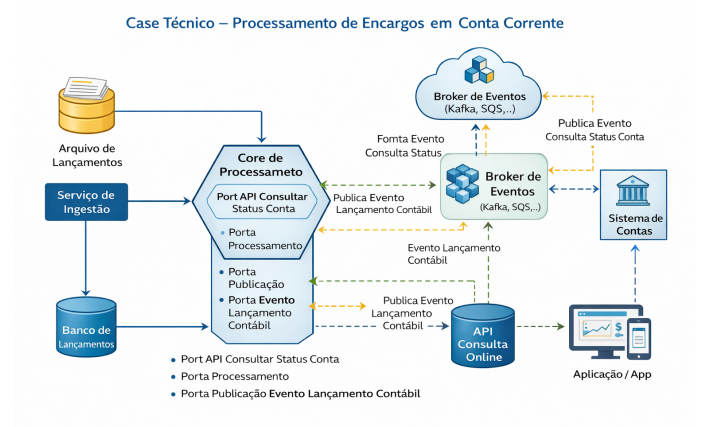

# ms-charge-account-worker
Projeto Referente ao Desafio do Técnico do Itau para área de Alta Renda  - Processamento de Encargos em Conta Corrente

# Case Técnico – Processamento de Encargos em Conta Corrente

### Contexto
O sistema deve processar diariamente um arquivo contendo lançamentos de encargos (débitos ou
créditos) que precisam ser aplicados em contas correntes. Cada lançamento deve ser validado
antes da aplicação, consultando o status da conta por meio de comunicação baseada em eventos
com o sistema de contas.

#### Volume esperado
- Até 20 milhões de registros por arquivo
- Início do processamento às 04:00
- Conclusão esperada até 06:00

#### Requisitos Técnicos

- Desenvolvimento em Java utilizando Spring Boot
- Arquitetura Hexagonal (Ports and Adapters)
- Comunicação com sistema de contas via eventos
- Persistência dos resultados de processamento
- Exposição de API para consulta online dos lançamentos processados

#### Fluxo de Processamento

- Leitura do arquivo de lançamentos
- Publicação de evento solicitando status da conta
- Recebimento do evento de resposta do sistema de contas 
- Validação do status da conta (ATIVA, CANCELADA, BLOQUEIO_JUDICIAL)
- Processamento ou recusa do lançamento 
- Envio de evento para o sistema contábil em caso de sucesso 
- Persistência do resultado e disponibilização via API

### Arquitetura Ilustrativa

### Pontos de Avaliação
- Organização da arquitetura e separação de responsabilidades
- Aplicação correta da arquitetura hexagonal
- Uso adequado de eventos
- Qualidade de código e testes
- Estratégias para escalabilidade e resiliência